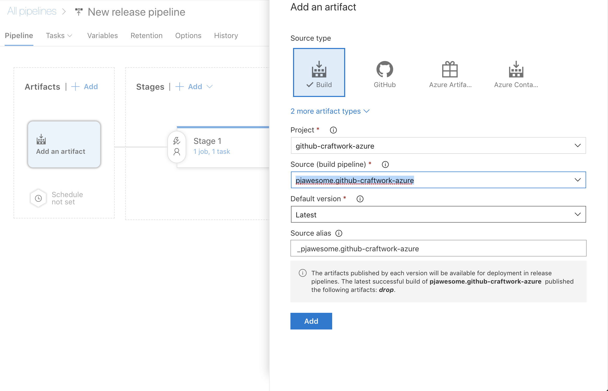
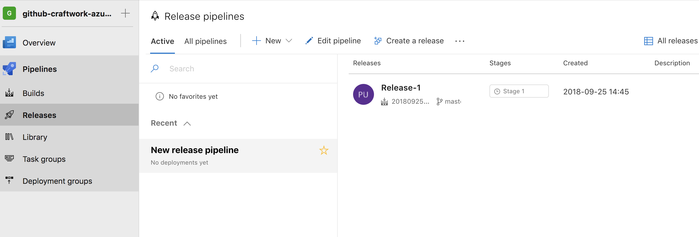
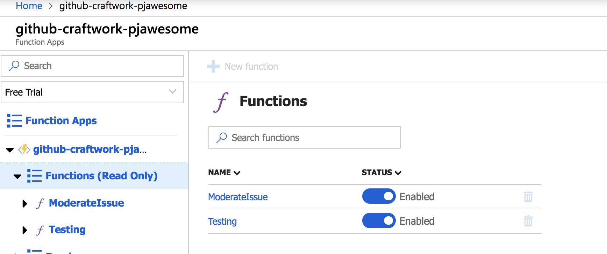
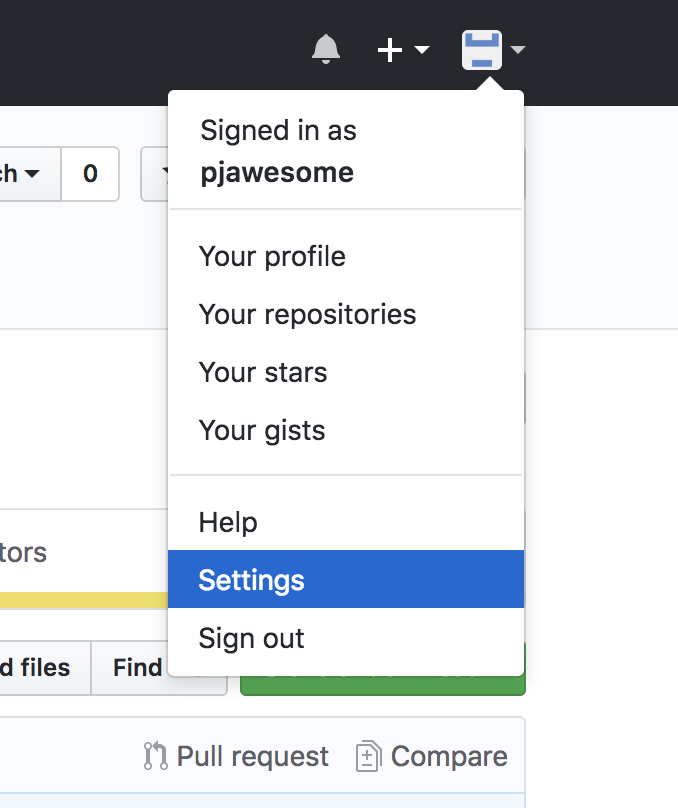

# GitHub Craftwork on Azure – Workshop Instructions
This README contains the accompanying instructions for the follow-along workshop. Follow the steps below in order to build your first GitHub App, an automated GitHub issue moderator bot, running on Azure Functions and deployed via Azure DevOps Pipelines.

## Prerequisites

A GitHub account, an Azure account (see below) and a browser are the only mandatory requirements.

**Please note**: For the Azure DevOps Pipelines integration to work, only a GitHub Account is needed. However for the Azure Function Apps deployment to work, you are going to need a separate Microsoft Azure account with a free subscription.

## Instructions

Ensure you have a working GitHub account, and [an Azure account with an active subscription](https://signup.azure.com ) (a free trial is available during signup – a phone number and a credit card are **required** although [no money will be exchanged](https://azure.microsoft.com/en-gb/offers/ms-azr-0044p/)).

## Step 1. Fork repository and install Pipelines

1. Log in to your GitHub account
2. Fork this repository: https://github.com/octodemo/github-craftwork-azure
3. Enable repository `Issues` (under Settings)

## Step 2. Install Azure DevOps Pipelines to your repository

1. Go to [Azure Pipelines · GitHub Marketplace · GitHub](https://github.com/marketplace/azure-pipelines)
	1. Select the `Free` plan
	2. Click `Install it for free`
2. Install Pipelines selecting the newly created repo in the dropdown
	1. Sign into your Azure account
	2. Create a new Organization for the Pipelines project
	3. Pick a region close to you
	4. Name yopur Pipelines project something like `github-craftwork-azure`
3. The Azure Pipelines project is now set up and integrated with your GitHub repository.
	1. Select the repository for creating the new pipeline
	2. Do not modify the pipeline definition YAML file
	3. Click RUN and wait until the build finishes successfully

💡 Congrats! You have integrated an automated CI tool using Azure DevOps Pipelines on your repository.

## Step 3. Create a new Azure Function App project in the Azure Portal

Our next step will be to create the Azure Function App where our code will be deployed.

1. Log in on the [Microsoft Azure portal](https://portal.azure.com/)
2. Click on `Create` -> `Compute` -> `Function App`

*Our function configuration*

3. Confirm and wait for the new resource to be deployed.

## Step 4. Create a new Release Pipeline to automatically deploy our changes

Let's go back to [Azure Pipelines](https://dev.azure.com).

1. Click on Releases
	1. New Pipeline
	2. Azure App Service deployment
		1. Create “Deploy to Azure Functions” stage
		2. Click on the job/task link in the UI
		3. Fill the subscription form -> Authorize
			1. Wait for `Configuring the Azure service connection...` to disappear
		4. Select your Function App from the 2nd dropdown
		5. Save (top right)
		6. Select the build pipeline as a source for the Artifact:

		7. Enable the Continuous deployment trigger

1. Go back to Builds
	1. Click on Queue build
		1. This will create a new release artifact
		2. Wait for the build to finish

2. Back to Releases, follow the release

3. Verify the function has been deployed in Azure -> Function Apps

💡 Awesome! We have now a complete CI/CD pipeline that automatically ships code when things change on our repository!

## Step 5. Create our GitHub App

We are now ready to create a GitHub App that will send webhooks to our app running on Azure.

In the Azure Function App dashboard, click on your function for “ModerateIssue”. Click on the `Get URL` button and copy the URL in your text editor (we are going to need this soon). Do the same for the `GitHub Secret` next to it.
	

Now visit the [Developer Settings](https://github.com/settings/apps) page on your GitHub account and click on `GitHub Apps`.

1. Click on Create a new App
2. Give the app a cool name and description :) 
3. In the `Homepage URL` `User authentication callback URL` and `Webhook URL` paste the URL provided by the Azure Function App
4. In the `Webhook Secret` field paste the `GitHub Secret` value from the Azure Function App page
5. Scroll down to the `Permissions` section and give the `Issues` Read & Write permission
6. Subscribe to the `Issues` events by flagging the checkbox
7. Leave the `Only this account` selection and confirm the app creation

The page will reload. At this point scroll down and:

1. Click on `Generate the private key`
2. Download the private key pem file to your computer
3. *Important*: copy the App ID somewhere (we're going to need this later)

We can now install the app on your repository by clicking on the `Install App` link in the navigation sidebar. Select the repository you forked at the beginning of this guide from the dropdown and confirm the installation.

Now go back to Azure Function Apps.

1. Select your function and click on `Application Settings`
2. Add new setting in the list: APP_ID `[your GitHub App ID here]`

We need to encode the contents of our `.pem` certificate using base64 in order to store it as an environment variable in Azure and make it available to our function.

- if you're on MacOS / Linux: `cat [path to the .pem file you just downloaded] | openssl base64 | pbcopy`
- alternatively use https://www.base64decode.org/ 
	
Once you have the pem file encoded, go back to the Azure Portal and click on your Function App. Go to `Application Settings` and add a new setting in the list with key APP_PEM and the encoded string as value.

💡 Woah! You buily your first GitHub App! Congratulations, human!

## Step 6. Enjoy your automatic moderator!

Create a new Issue in your repository and wait for our bot to interact with it!

### Further Reading

- GitHub App Walkthrough [octokit.net/github-apps.md at master · octokit/octokit.net · GitHub](https://github.com/octokit/octokit.net/blob/master/docs/github-apps.md#github-app-walkthrough) 
- VS CODE functions
[Create your first function in Azure using Visual Studio Code | Microsoft Docs](https://docs.microsoft.com/en-us/azure/azure-functions/functions-create-first-function-vs-code)

